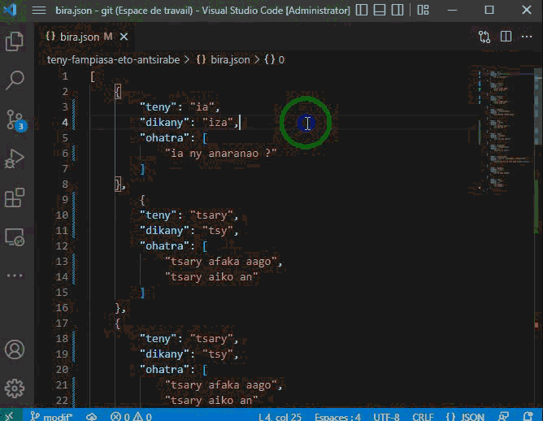

# Teny fampiasa eto Antsirabe
Ireo teny fampiasa mampiavaka an'Antsirabe sy ny dikany amin'ny teny malagasy fantatry ny maro (ôfisialy).

## Hampiditra teny sy/na ohatra
Raha hampiditra teny vaovao dia araho ito toromarika manaraka ito:

1. Manaova `Fork` ka tsindrio ilay bokotra volon-davenona amin'ny farany havanana mifanitsy amin'ny anaran'ilay `repository`  
2. Alaivo ho ao amin'ny "ordinateur"-nao ilay `Fork` teo amin'ny alalan'ny `git clone`

3. Mamoròna `branch` vaovao ohatra `git branch fanovana`

4. Mifindrà ao amin'ilay `branch` vao noforoninao teo `git checkout fanovana`

5. Sokafy ilay `bira.json` ary jereo sao efa tafiditra ao ilay tianao ampidirina.

6. Ampitovio amin'ito ohatra ambany ito izay ampidirinao ary ataovy eny amin'ny farany ambany amin'ilay `bira.json`

```
[
    {
        "teny" : "tsa",
        "dikany" : "tsy",
        "ohatra" : [
            "tsa haiko",
            "tsa hitako"
        ]
    }
]
```

Efa natao `array` ny `ohatra` ka raha toa ka efa tafiditra ilay `teny` dia azonao atao ny manampy ohatra ka eo ambanin'ilay `ohatra` farany no anoratana azy.

7. Tehirizo ny fanovana nataonao.

8. Manaova `commit` hanamarihanao ilay fanovana.

9. Alefaso ao amin'ilay `Fork` nataonao ilay fanovana.

10. Manaova `Pull requests` ao amin'ny [https://github.com/IT-Community-Antsirabe/teny-fampiasa-eto-antsirabe](https://github.com/IT-Community-Antsirabe/teny-fampiasa-eto-antsirabe)

## Fanamarihana
- Ialao ny fanoratra SMS.
- Mba tsy ahasarotra ny fanekena ny `pull request` izay ataonao dia manaova foana `git pull` mialohan'ny handefasanao azy.

## Fanatsarana
Alohan'ny handefasana ny fanovana makany amin'ny `Fork` dia tsara raha atao manaraka ny alfabeta ny lisitry ny teny mba hanamora ny fitadiavana teny.

Ahafahana manao izany dia misy `Extensions` `VSCode` maro azo ampiasaina, fa ity iray ity no atao ohatra sy ampiasaina eto : [Sort JSON](https://marketplace.visualstudio.com/items?itemName=Thinker.sort-json)

### Fomba hakana azy
Sokafy ny `VSCode` dia tsindio ny `(Ctrl + P)` ary adikao ao ity `Commande` manaraka ity

```
ext install Thinker.sort-json
```
### Fomba fampiasana azy 
[]